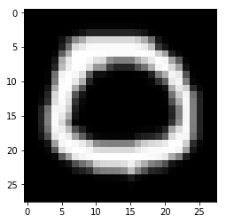
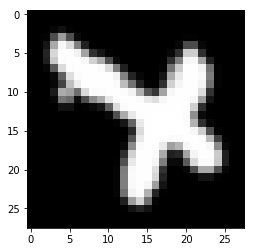

# Tensorflow神经网络模型训练与冻结


## 概要

使用Tensorflow构建一个神经网络模型，用于识别字符`X`跟字符`O`.  使用上节课处理过的训练数据, 对模型进行训练. 训练完成之后，冻结模型, 导出pb模型文件。


## 导入依赖


```python
import tensorflow as tf
from keras.utils import to_categorical # 用于转换label为one-hot矩阵
import numpy as np
import matplotlib.pyplot as plt
```

    Using TensorFlow backend.


## 导入数据集

XO数据集是从EMNIST数据集经过预处理得到的，只筛选XO相关的数据,并且将向量转换为了2D图像。
直接导入序列化后的数据集二进制文件。


训练集里面, 字符`O`跟字符`X`各4800个样本。

测试集里面, 字符`O`跟字符`X`各800个样本。

他们的顺序是打乱的。


```python
import pickle

dataset = None

with open('../../common/xo_dataset.bin', 'rb') as f:
    dataset = pickle.load(f)
    
# 训练集图像向量
train_images = dataset['train_images']
# 训练集标签
train_labels = dataset['train_labels']
# 测试集图像向量
test_images = dataset['test_images']
# 测试集标签
test_labels = dataset['test_labels']
```

### 样本图片
每个样本图片的尺寸是28x28的灰度图


```python
train_images[0].shape
```


    (28, 28)


```python
#　字符O的样例图片
plt.imshow(train_images[0], cmap='gray')
```


    <matplotlib.image.AxesImage at 0x7fa817955748>





```python
# 字符X的样例图片
plt.imshow(train_images[3], cmap='gray')
```


    <matplotlib.image.AxesImage at 0x7fa8178ea978>





###  Label数据

关于label数据，标签数据数值范围是0-1, 0代表字符`O`, 1代表字符`X`


```python
# 打印前10个label数据
train_labels[0:10]
```


    array([0, 1, 1, 1, 1, 0, 1, 1, 1, 0], dtype=uint8)


## 数据预处理

### 归一化
将样本数据原来`0-255`数值范围的整数格式`uint8`，转换为`0-1.0`的浮点数`float32`。


```python
train_images = train_images / 255.0
test_images = test_images / 255.0
```

### 构造one-hot矩阵

将原来的标签数组转换为one-hot矩阵


```python
train_labels = to_categorical(train_labels)
test_labels = to_categorical(test_labels)
```

打印一下转换后的one-hot矩阵的前10个样本，可以看到train_label被转换成了`Nx2`的结构， 第一列代表是不是字符`O`, 是的话对应的列就是`1`, 否则就是`0`. 同样,矩阵的第二列代表是否为字符`X`，是的话对应的列就是`1`, 否则就是`0`。


```python
train_labels[:10]
```


    array([[1., 0.],
           [0., 1.],
           [0., 1.],
           [0., 1.],
           [0., 1.],
           [1., 0.],
           [0., 1.],
           [0., 1.],
           [0., 1.],
           [1., 0.]], dtype=float32)


## 生成Batch数据

在用Tensorflow进行模型训练的时候，需要生成Batch数据，就是模型迭代一次权重所需要的样本。


```python
def next_batch(train_images, train_labels, batch_size):
    # 生成索引数组 [0, 1, 2, 3, 4. ...., N]
    idxs = np.array([i for i in range(len(train_images))])
    # 将原来的数组重新打乱顺序
    np.random.shuffle(idxs)
    # 取前batch_size个索引
    top_idxs = idxs[:batch_size]
    # 根据索引数组得到训练集的图像
    return train_images[top_idxs], train_labels[top_idxs]
    
```

## 权重初始化

在神经网络模型训练之前，需要给神经网络的权重设置一个初始值，一般采用随机生成的方式。


```python
def weight_variable(shape):
    '''
    权重初始化  weight init
    初始化为一个接近0的很小的正数  init to a small number close to zero
    '''
    initial = tf.truncated_normal(shape, stddev = 0.1)
    return tf.Variable(initial)

def bias_variable(shape):
    '''Bias变量初始化'''
    initial = tf.constant(0.1, shape = shape)
    return tf.Variable(initial)

```

## 定义神经网络的结构

在设计神经网络结构的时候，一定要去查一下**K210当下是否支持相应的Layer与激活函数**.

你可以在[kendryte/nncase](https://github.com/kendryte/nncase/)的README页面查看K210支持的层**Support Layer**.

神经网络来说,用到的层只有

K210所支持的激活函数如下
* Sigmoid
* Relu
* Relu6
* LeakyRelu
* Softmax

激活函数，在当前的这个模型里面，用到了`Relu` 还有`Softmax`. 

当前的神经网络模型还用到了全连接层**FullyConnected**。

K210支持的卷积层，池化层等其他层，请查阅文档。

输入层的尺寸为 Nx28x28， 每一个输入样本都是一个28x28的矩阵


```python
# 输入的是28x28的图片 通道数为1
input_size = [None, 28, 28]
# Dropout的概率
keep_prob = tf.placeholder("float")
# 输入数据
x = tf.placeholder(tf.float32, input_size)
```

接下来需要对模型进行变换，数据由原来的`28x28`的二维数组，转换为`28x28x1`的三维数组。

之所以这样做， 是跟后期模型转换的时候有关，后面的教程我们再谈。


```python
x_image = tf.reshape(x, [-1, 28, 28, 1])  
```

接下来是Flatten操作，将原来的28x28x1的结构变为1维向量。 与卷积神经网络不同， 神经网络并不会参考图像的2D空间特征，只是将其当做一个向量来处理。

那为什么我们不在图像预处理的时候就转换成1维的数据呢？ 

嘻嘻,是为了最大限度的复用K210的提供的Demo例程。


```python
# Flatten层
x_flat = tf.layers.flatten(x_image)
```

    WARNING:tensorflow:From <ipython-input-14-061b67464529>:2: flatten (from tensorflow.python.layers.core) is deprecated and will be removed in a future version.
    Instructions for updating:
    Use keras.layers.flatten instead.


接下来是神经网络的全连接层(Fully Connected Layer),作为第一层隐藏层Hidden Layer。神经网络除了输入层与输出层，中间的均称之为隐藏层。
全连接层的运算，可以转换为**矩阵运算**, 写成$y = X*W + b$的形式，　其中`X`是上一层的输入, `W`是权重矩阵, `b`是偏移量`bias`.


转变为矩阵运算之后可以大幅提高计算速度，在权值保存的时候也更方便。

神经网络有各种各样的激活函数**Active Function**，这里我们使用`Relu`作为神经网络的激活函数.


```python
# 输入向量的维度
IMAGE_RESHAPED = 784
# 每层隐藏层神经元的个数
N_HIDDEN = 128

# 第一层 全连接层1
W_fc1 = weight_variable([IMAGE_RESHAPED, N_HIDDEN])
b_fc1 = bias_variable([N_HIDDEN])
h_fc1 = tf.nn.relu(tf.matmul(x_flat, W_fc1) + b_fc1)
```

    WARNING:tensorflow:From /usr/local/lib/python3.6/dist-packages/tensorflow/python/framework/op_def_library.py:263: colocate_with (from tensorflow.python.framework.ops) is deprecated and will be removed in a future version.
    Instructions for updating:
    Colocations handled automatically by placer.


`IMAGE_RESHAPED=784`是`28x28x1=784`的数据flatten之后的尺寸, `N_HIDDEN`是隐藏层神经网络的个数, 一共128个神经元，同时也对应着128个bias.

在模型训练的时候，还可以加上`Dropout`层，随机删除神经元，　网络表现力强，而且可以防止过拟合。

K210并不支持`Dropout`层，但是训练的时候可以加。

在模型训练结束之后，再将Dropout层删除。

`keep_prob`代表每次迭代的时候神经元保留的概率.


```python
# Dropout
h_fc1_drop = tf.nn.dropout(h_fc1, keep_prob)
```

    WARNING:tensorflow:From <ipython-input-16-31fb27abee06>:2: calling dropout (from tensorflow.python.ops.nn_ops) with keep_prob is deprecated and will be removed in a future version.
    Instructions for updating:
    Please use `rate` instead of `keep_prob`. Rate should be set to `rate = 1 - keep_prob`.


第二层隐藏层的结构跟第一层的很类似，上一层是`N_HIDDEN`个神经元, 当前的隐藏层同样也有`N_HIDDEN`个


```python
# 第二层 全连接层2
W_fc2 = weight_variable([N_HIDDEN, N_HIDDEN])
b_fc2 = bias_variable([N_HIDDEN])
h_fc2 = tf.nn.relu(tf.matmul(h_fc1_drop, W_fc2) + b_fc2)
h_fc2_drop = tf.nn.dropout(h_fc2, keep_prob)
```

最后一层是输出层，该层也是全连接层，上一层神经元的节点个数是`N_HIDDEN`个，当前层的神经元个数为2,分别代表`O`跟`X`.

激活函数使用的是`Softmax`, 使输出结果正规化。令输出结果范围在0-1之间, 而且所有的输出层结果数值相加等于1，相当于每个输出代表是这个类的概率，　`y_nn`就是最终的输出。


```python
# 第三层是输出层，　
W_fc3 = weight_variable([N_HIDDEN, 2])
b_fc3 = bias_variable([2])
y_nn = tf.nn.softmax(tf.matmul(h_fc2_drop, W_fc3) + b_fc3)
```

## 模型训练与评估

```python
# 真实的label数据 one_hot矩阵
y_ref = tf.placeholder("float", [None, 2])
```

选用交叉熵**Cross Entroy**作为损失函数**Lost Function**, 损失函数是权重优化的依据，根据损失函数的梯度来优化参数。


```python
# 交叉熵
cross_entropy = -tf.reduce_sum(y_ref * tf.log(y_nn))
```

使用`ADAM`优化器来迭代更新权重, 制定学习率为`0.0001`, 定义ADam优化器的目标是使得损失函数最小化

这里需要注意的是优化器的选择并不受K210的约束, 只在模型训练，权值迭代的时候产生作用,并不属于网络结构中的一部分。


```python
learning_rate = 0.0001 # 学习率
# 定义优化器为ADam
train_step = tf.train.AdamOptimizer(learning_rate).minimize(cross_entropy) #使用adam优化器来以0.0001的学习率来进行微调
```

计算准确率**Accuracy** `acc`, 作为评价模型的指标。


```python
# 是否准确的布尔值列表
correct_prediction = tf.equal(tf.argmax(y_nn,1), tf.argmax(y_ref,1)) #判断预测标签和实际标签是否匹配
#　计算平均值即为准确率
accuracy = tf.reduce_mean(tf.cast(correct_prediction,"float"))
```

tf.Saver的使用可以看这篇Blog : [Tensorflow 模型的保存,读取和冻结,执行](https://www.jarvis73.cn/2018/04/25/Tensorflow-Model-Save-Read/)


```python
saver = tf.train.Saver()
sess = tf.Session()
sess.run(tf.global_variables_initializer()) #初始化变量
merged = tf.summary.merge_all() 
# 制定检查点等模型训练日志存放在同级目录下的logs文件夹
writer = tf.summary.FileWriter('logs',sess.graph)
```

重复训练500个Batch,　每隔100个Batch输出一次日志


```python
for i in range(501): #开始训练模型，循环训练500次
    batch = next_batch(train_images, train_labels, 150) #batch大小设置为50
    if i % 100 == 0:
        # 在测试的准确率的时候，需要设置keep_prob为1
        train_accuracy = accuracy.eval(session = sess,
                                       feed_dict = {x:batch[0], y_ref:batch[1], keep_prob:1.0})
        print("step %d, train_accuracy %g" %(i, train_accuracy))
        # 保存检查点
        saver.save(sess, 'model/nn_xo.ckpt')
    # feed_dict中加入参数`keep_prob`控制`dropout`比例。
    train_step.run(session = sess, feed_dict = {x:batch[0], y_ref:batch[1],
                   keep_prob:0.7}) #神经元输出保持不变的概率 keep_prob 为0.5

```

    step 0, train_accuracy 0.593333
    step 100, train_accuracy 0.993333
    step 200, train_accuracy 0.986667
    step 300, train_accuracy 0.993333
    step 400, train_accuracy 0.993333
    step 500, train_accuracy 0.993333


最终拿测试集来评价一下模型的准确率


```python
sess = tf.InteractiveSession()
sess.run(tf.global_variables_initializer())
saver = tf.train.Saver(tf.global_variables())
saver.restore(sess, 'model/nn_xo.ckpt')
# 查看测试集的准确率
print( "test accuracy %g" % accuracy.eval(feed_dict={
    x:test_images, y_ref:test_labels, keep_prob:1.0}))

```

    WARNING:tensorflow:From /usr/local/lib/python3.6/dist-packages/tensorflow/python/training/saver.py:1266: checkpoint_exists (from tensorflow.python.training.checkpoint_management) is deprecated and will be removed in a future version.
    Instructions for updating:
    Use standard file APIs to check for files with this prefix.
    INFO:tensorflow:Restoring parameters from model/nn_xo.ckpt
    test accuracy 0.99125


## 模型冻结

在模型训练完成之后, 所有的网络的权重还有Bias都不再变更了。接下来我们需要通过**模型冻结 Freeze**
模型冻结的其中一种方法是将原来的变量`tf.variable`转变为常量`tf.constant`,并将权重保存在模型文件里面。

通过`eval()`函数可以将tf.Variable导出权重的ndarray, 如下所示


```python
# 只输出前20个Bias
b_fc1.eval()[:20]
```


    array([0.0987657 , 0.09167684, 0.10189684, 0.09403343, 0.10781259,
           0.10423934, 0.10627533, 0.10272716, 0.09875294, 0.09838467,
           0.11374552, 0.10951015, 0.10813315, 0.11166847, 0.11739392,
           0.09535608, 0.10067159, 0.09764701, 0.09580787, 0.10748729],
          dtype=float32)


获得权重矩阵


```python
# 获取权重矩阵
WFC1 = W_fc1.eval()
BFC1 = b_fc1.eval()
WFC2 = W_fc2.eval()
BFC2 = b_fc2.eval()
WFC3 = W_fc3.eval()
BFC3 = b_fc3.eval()
```

接下来，我们需要创建一个新的图, 做如下调整：

1. 将原来的变量改为常量，并命名
2. 命名输入层跟输出层。　这里输入层命名为`input_node`, 输出层命名为`ouput_node`
3. 删除一些层，例如Dropout层只在模型训练的时候有用，前向计算就没了用处。
4. 改变输入层的结构，训练的时候输入层是针对样本数据的,在实际部署的时候结构为`[-1, 28, 28, 1]`


```python
# 创建一个Graph对象
g = tf.Graph()
```


```python
with g.as_default():
    # 定义输入节点
    x_image = tf.placeholder("float", shape=[None, 28, 28, 1], name="input_node")
    # 第一层隐藏层
    WFC1 = tf.constant(WFC1, name="WFC1")
    BFC1 = tf.constant(BFC1, name="BFC1")
    FC1 = tf.layers.flatten(x_image)
    FC1 = tf.nn.relu(tf.matmul(FC1, WFC1) + BFC1)
    # 第二层隐藏层
    WFC2 = tf.constant(WFC2, name="WFC2")
    BFC2 = tf.constant(BFC2, name="BFC2")
    FC2 = tf.nn.relu(tf.matmul(FC1, WFC2) + BFC2)
    # 第三层输出层
    WFC3 = tf.constant(WFC3, name="WFC3")
    BFC3 = tf.constant(BFC3, name="BFC3")
    # 定义输出节点
    OUTPUT = tf.nn.softmax(tf.matmul(FC2, WFC3) + BFC3, name="output_node")
    
    
    sess = tf.Session()
    sess.run(tf.global_variables_initializer())

    graph_def = g.as_graph_def()
    # 保存模型,存放在同级目录下
    tf.train.write_graph(graph_def, "./", "nn_xo.pb", as_text=False)
    
```
