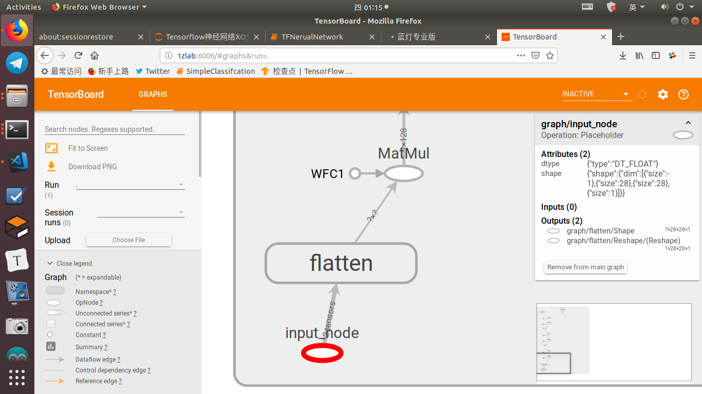
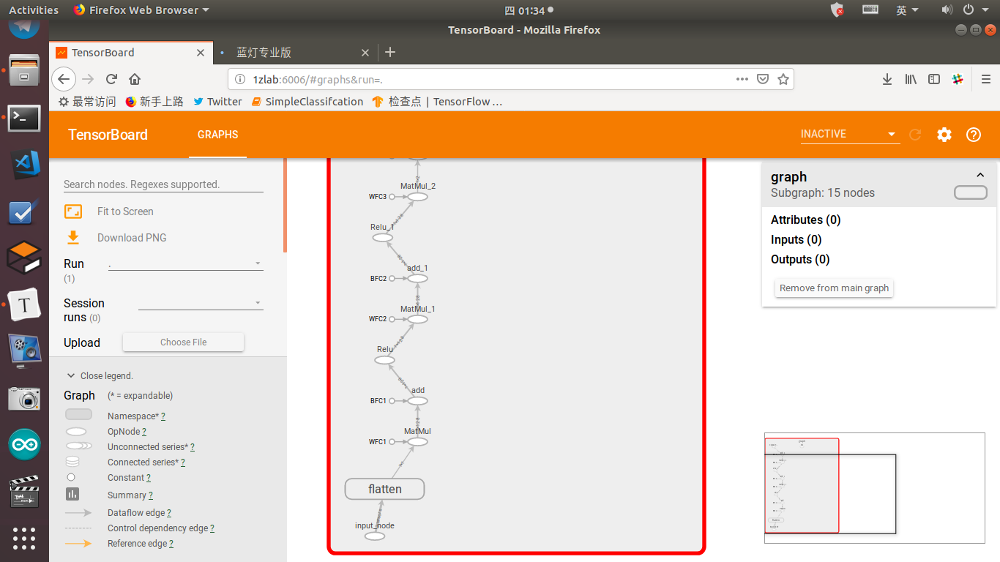
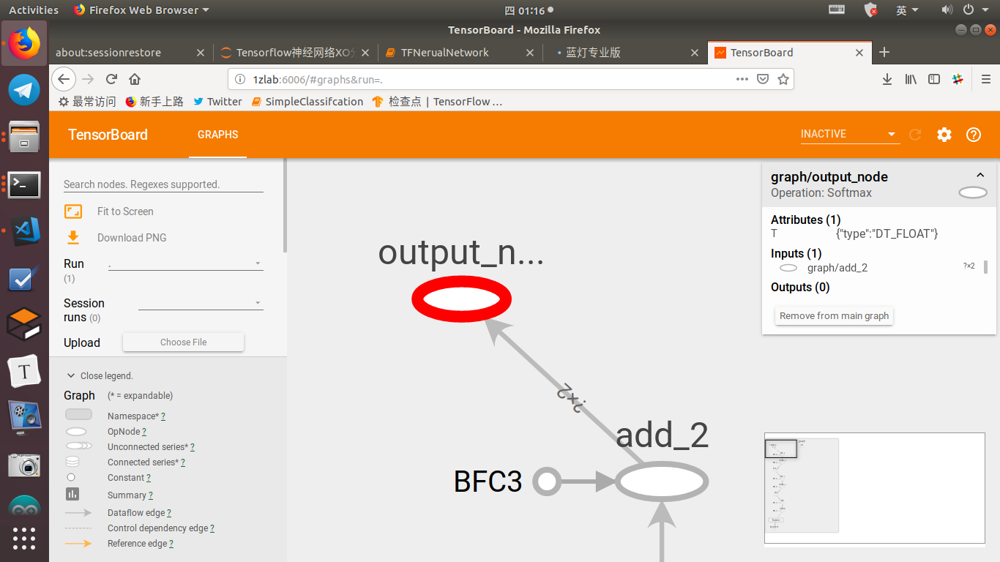
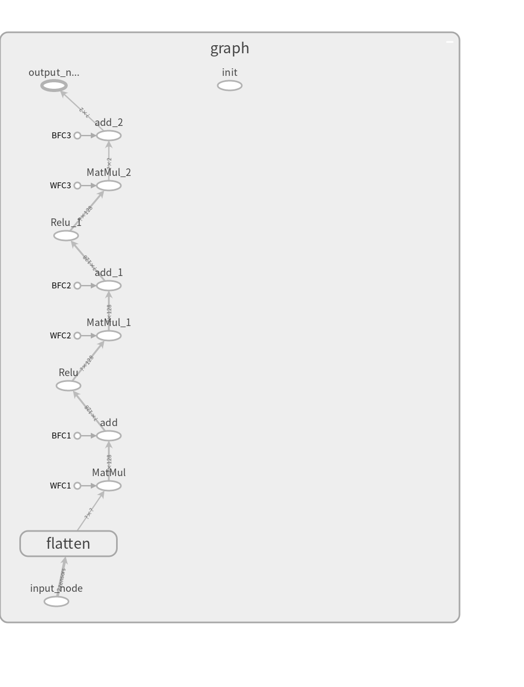

# TensorBoard模型结构可视化


[TOC]




## 概要

通过TensorBoard查看神经网络结构


## 放置pb文件

将生成的Tensorflow模型文件`<你的模型文件名称>.pb` 放置到`Maix_Toolbox` 的工作区`workspace` 文件夹中。

那当前的这个模型名为例, 模型文件的名称为`nn_xo.pb`


## 运行脚本

在`Maix_Toolbox`的根目录下有一个`gen_pb_graph.py`

在终端运行这个脚本文件，后面紧跟模型文件路径。

```bash
Maix_Toolbox$ python3 gen_pb_graph.py ./workspace/nn_xo.pb 
```

日志输出如下

```
WARNING:tensorflow:From gen_pb_graph.py:9: FastGFile.__init__ (from tensorflow.python.platform.gfile) is deprecated and will be removed in a future version.
Instructions for updating:
Use tf.gfile.GFile.
TensorBoard 1.13.1 at http://<你的主机名称>:6006 (Press CTRL+C to quit)
```

访问网址，或者直接按住`CTRL` 然后点击这个url

首页是`Main Graph`界面，双击`Graph`按钮, 就可以看到整个计算图的数据流。


## 查看网络模型




详细展开来看, 点击最底部的`input_node` , `input_node` 是这个模型的**输入层的名称**, 是用户定义的.

如果名字过长主图里可能显示不全，你可以在右侧的信息栏查看完整的信息。

里面有说明输入层的数据类型，还有数据的维度。

```
dtype 数据格式
{"type":"DT_FLOAT"}　浮点数类型

shape　输入样本的形状

{"shape":{"dim":[{"size":-1},{"size":28},{"size":28},{"size":1}]}}
第一个-1代表变长，可以输入多个样本, 每个样本数据格式为28x28x1
对于图像数据来讲即为　宽度28 高度28 通道数为1
```


同样, 可以点击最上方的输出层, 在这个模型里输出层的名称为**output_node**

从信息栏中可以看到输出层的算子为`Softmax` , 输出类型为浮点数。




## 导出PNG图片

在左侧的侧边栏, 有一个`Download PNG` 下载PNG图片的功能, 可以下载完整的计算图的图像。



## 终止TensorBoard

回到终端, 按`CTRL+C` 终止TensorBoard进程。