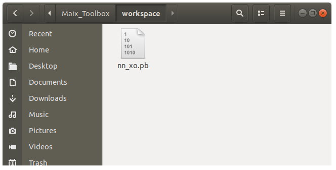

# TensorFlow模型转换为TFlite模型


[TOC]


## 概要

Tensorflow模型的后缀是`pb`, TFLite模型的后缀是`tflite`. 

从`pb`格式转换为`tflite`格式, 需要使用`Maix_Toolbox` 根目录下的`pb2tflite.sh`脚本。


## 放置pb文件

模型转换脚本默认只从`Maix_Toolbox/workspace`文件里检索模型, 转换的模型也保存在`workspace`里面。


将生成的Tensorflow模型文件`<你的模型文件名称>.pb` 放置到`Maix_Toolbox` 的工作区`workspace` 文件夹中。

那当前的这个模型名为例, 模型文件的名称为`nn_xo.pb`




## 运行模型转换脚本

运行脚本`./pb2tflite.sh`

```bash
$ ./pb2tflite.sh 
This script help you generate cmd to convert *.pb to *.tflite
Please put your pb into workspace dir

```

第一步需要填入模型的名称，不包括`workspace` 这个文件夹名，直接写文件名。

```
1. pb file name: (don't include workspace)
nn_xo.pb <- 填入模型文件名称，然后回车
```

接下来需要依次填入模型文件输入节点与输出节点的名称，注意每个模型的输入输出名称都不一样，因为这个名字是用户自定义的。　

你可以使用`TensorBoard`可视化工具，查看`pd`计算图的结构, 可以查看对应的输入层还有输出层的名称，详情见文档**TensorBoard模型结构可视化**


```
2. input_arrays name:
input_node <- 输入节点名称
3. output_arrays name:
output_node　<- 输出节点名称

```

然后，你需要填入模型输入层的尺寸, 同样可以通过TensorBoard查看输入层的尺寸，文档里也有讲。

```
4. input width:
28 <- 图像宽度
5. input height:
28 <- 图像高度
6. input channel:
1　<- 图像通道数，　灰度图是单通道,彩图是三通道

```

日志输出如下

```
-----------------------------------
The command you need is:
脚本自动生成了　toco的命令行　指定了各种刚才填写的参数
-----------------------------------
toco --graph_def_file=workspace/nn_xo.pb --input_format=TENSORFLOW_GRAPHDEF --output_format=TFLITE --output_file=workspace/nn_xo.tflite --inference_type=FLOAT --input_type=FLOAT --input_arrays=input_node --output_arrays=output_node --input_shapes=1,28,28,1
接下来会自动执行这个命令，下面是输出日志
2019-05-09 02:06:20.028630: I tensorflow/core/platform/cpu_feature_guard.cc:141] Your CPU supports instructions that this TensorFlow binary was not compiled to use: AVX2 FMA
2019-05-09 02:06:20.062106: I tensorflow/core/platform/profile_utils/cpu_utils.cc:94] CPU Frequency: 2294660000 Hz
2019-05-09 02:06:20.063459: I tensorflow/compiler/xla/service/service.cc:150] XLA service 0x152b8e0 executing computations on platform Host. Devices:
2019-05-09 02:06:20.063495: I tensorflow/compiler/xla/service/service.cc:158]   StreamExecutor device (0): <undefined>, <undefined>
```

脚本执行完毕,可以在`workspace`文件夹找到同名的`.tflite`文件。

```bash
Maix_Toolbox/workspace$ ls
nn_xo.pb  nn_xo.tflite
```

