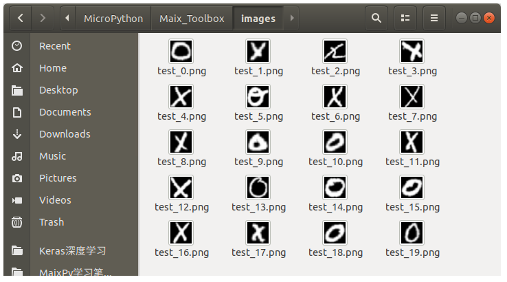

# TFLite模型转换为K210模型

[TOC]

## 概要

使用nncase工具箱与MaixToolbox里面的工具完成K210模型转换。


## 下载nncase工具箱

TFlite模型转换为K210的模型格式，需要借助嘉楠的nncase工具箱。

运行`get_nncase.sh` 脚本，自动从github下载nncase的linux的编译好的二进制文件, 解压至`Maix_Toolbox`并重命名为`nnc`

```bash
Maix_Toolbox$ ./get_nncase.sh
```

关于nncase的使用方法，可以查看其github主页[nncase-github](https://github.com/kendryte/nncase)

## 添加测试图片

TFlite模型在转换为K210模型的时候，会对原来的网络结构进行量化**quantization**, 量化会将原来网络中的浮点运算转化为8比特整数运算，起到压缩模型尺寸与加速的目的。线性激活函数, relu激活函数, relu6激活函数等均可以转换为等价的量化运算。


在`Maix_Toolbox`的根目录下有一个`images`文件夹，用于存放量化图片数据, 在量化的过程中需要用到。



> 注: TFlite也有量化的功能，但是nncase暂不支持此功能。

测试图片必须直接放置在`images`文件夹中。　图像的名称可以任意，图像尺寸跟训练集的图像尺寸保持一致，可以从训练集的图像样本中选取一些有代表性的，放在`images`文件夹中。


## 运行转换脚本

执行`Maix_Toolbox`中的`tflite2kmodel.sh `脚本，　这段脚本可以将`tflite`模型转换为K210的kmodel模型。

执行这个脚本的时候，后面紧跟tflite模型的路径.

```bash
Maix_Toolbox$ ./tflite2kmodel.sh ./workspace/nn_xo.tflite 
```

这个脚本其实是封装了`nncase`中的`ncc`指令，等效为:

```
./ncc/ncc -i tflite -o k210model --dataset images ./workspace/nn_xo.tflite ./workspace/nn_xo.kmodel
```

* `-i` 指定输入模型的格式为`tflite`
* `-o` 制定输出模型的格式为`k210model`
* `--dateset` 指定量化数据集文件夹为`Maix_Toolbox/images` 
* `./workspace/nn_xo.tflite` 输入模型的路径与名称
* `./workspace/nn_xo.kmodel` 输出模型的路径与名称


下面是转换日志

```
2019-05-09 02:41:13.477395: I tensorflow/core/platform/cpu_feature_guard.cc:141] Your CPU supports instructions that this TensorFlow binary was not compiled to use: SSE4.1 SSE4.2 AVX AVX2 FMA
打印一下转换为KModel的量化结构
0: InputLayer -> 1x1x28x28
1: TensorflowFlatten 1x1x28x28 -> 1x784
2: Quantize 1x784 -> 1x784 量化 浮点数转换为8bit整数
3: K210AddPadding 1x784 -> 1x784x4x4　添加Padding
4: K210Conv2d 1x784x4x4 -> 1x128x4x4　二维卷积层
5: K210Conv2d 1x128x4x4 -> 1x128x4x4　二维卷积层
6: K210Conv2d 1x128x4x4 -> 1x2x4x4 二维卷积层
7: K210RemovePadding 1x2x4x4 -> 1x2 去除Padding
8: Dequantize 1x2 -> 1x2　反量化　8-bit整数转换为浮点数
9: Softmax 1x2 -> 1x2　Softmax激活函数
10: OutputLayer 1x2　输出层
硬件资源占用信息
KPU memory usage: 58368 B　
Main memory usage: 6272 B

```

转换完成之后，工作区的文件夹中就多了个一个`.kmodel` 文件。

```
Maix_Toolbox$ ls workspace/
nn_xo.kmodel  nn_xo.pb  nn_xo.tflite
```


## 拓展阅读

如果你对神经网络的量化技术感兴趣的话，可以阅读相关论文/博客。

[8-Bit Quantization and TensorFlow Lite: Speeding up mobile inference with low precision](https://heartbeat.fritz.ai/8-bit-quantization-and-tensorflow-lite-speeding-up-mobile-inference-with-low-precision-a882dfcafbbd)


[Quantization and Training of Neural Networks for EfficientInteger-Arithmetic-Only Inference](http://openaccess.thecvf.com/content_cvpr_2018/papers/Jacob_Quantization_and_Training_CVPR_2018_paper.pdf)


[A Survey on Methods and Theories of Quantized Neural Network](https://arxiv.org/pdf/1808.04752.pdf)


[Quantized Neural Networks:  Training Neural Networks withLow Precision Weights and Activations](http://www.jmlr.org/papers/volume18/16-456/16-456.pdf)


[Pete Warden's blog](https://petewarden.com/) 系列博客

[Why are Eight Bits Enough for Deep Neural Networks?](https://petewarden.com/2015/05/23/why-are-eight-bits-enough-for-deep-neural-networks/)


[How to Quantize Neural Networks with TensorFlow](https://petewarden.com/2016/05/03/how-to-quantize-neural-networks-with-tensorflow/)


[What I’ve learned about neural network quantization](https://petewarden.com/2017/06/22/what-ive-learned-about-neural-network-quantization/)


