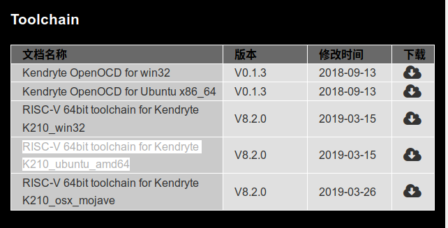
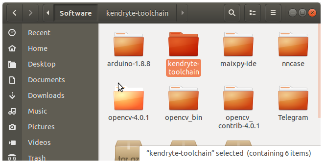
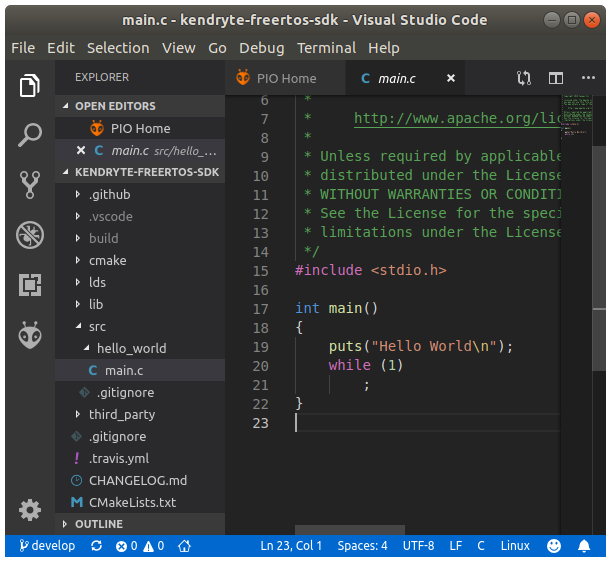
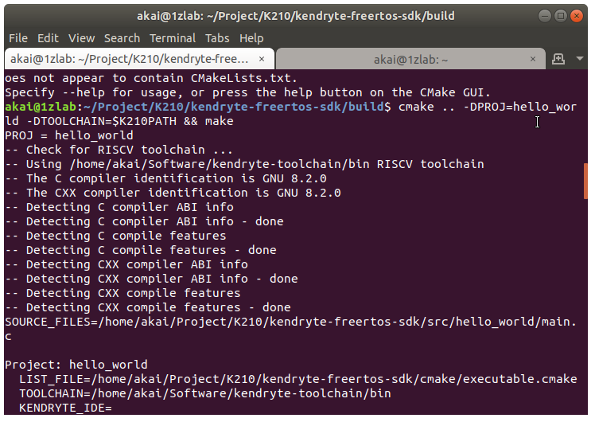
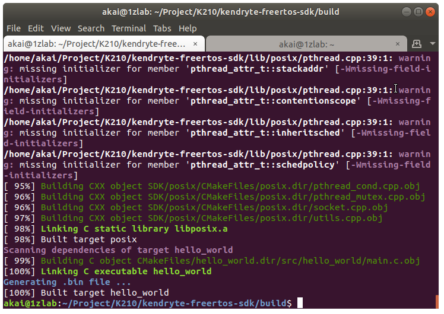
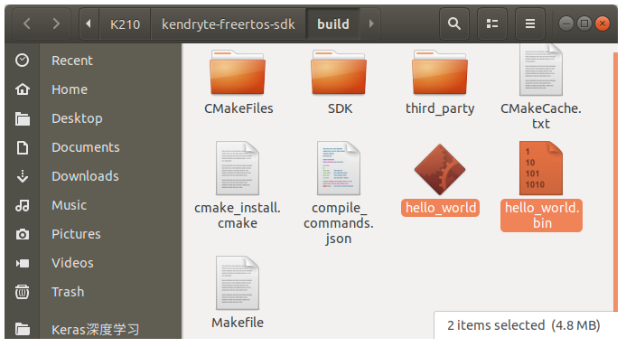
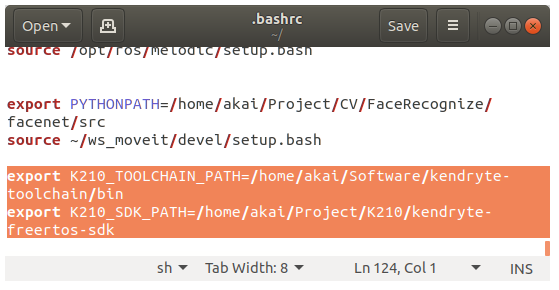

# K210工具链与源码编译


[TOC]


## 下载K210的工具链

在　[Kendryte官方下载界面](https://kendryte.com/downloads/) 里面的`Toolchain`工具包，根据自己的操作系统选择。

这里我选择的是`RISC-V 64bit toolchain for Kendryte K210_ubuntu_amd64` Ubuntu的版本.




下载后将下载的[kendryte-toolchain-ubuntu-amd64-8.2.0-20190213.tar.gz](https://s3.cn-north-1.amazonaws.com.cn/dl.kendryte.com/documents/kendryte-toolchain-ubuntu-amd64-8.2.0-20190213.tar.gz) 文件移动到一个文件夹下, 例如`~/Software`

接下来需要解压`tar.gz`文件

```
tar -zxvf kendryte-toolchain-ubuntu-amd64-8.2.0-20190213.tar.gz 
```




然后添加系统环境变量, 编辑`.bashrc`文件

```bash
gedit ~/.bashrc
```

末尾添加这一行，路径就填写你存放`kendryte-toolchain`的路径。

`akai` 是我的用户名, 需要改成自己的用户名

```bash
export K210_TOOLCHAIN_PATH=/home/akai/Software/kendryte-toolchain/bin
```

> 注: 必须填写全路径

保存后关闭`.bashrc`文件.

更新系统环境变量

```
source ~/.bashrc 
```

## 下载K210 FreeRTOS SDK

[Kendryte K210 FreeRTOS SDK](https://github.com/kendryte/kendryte-freertos-sdk)

使用Git下载克隆`K210 FreeRTOS SDK`

```
git clone https://github.com/kendryte/kendryte-freertos-sdk.git
```

下载完毕后, 进入Terminal.

```bash
$ pwd
/home/akai/Project/K210/kendryte-freertos-sdk
```

在`src`文件夹下创建你的工程，默认sdk里面自带了一个`hello_world` 例程。




那么接下来我们就开始尝试编译这个`hello_world`例程吧


创建一个`build`文件夹，用于存放编译后的二进制文件。

```bash
$ mkdir build
```

进入到`build`文件夹下

```bash
$ cd build
$ pwd
/home/akai/Project/K210/kendryte-freertos-sdk/build
```

接下来运行编译的指令, `-DPROJ` 代表当前要编译的工程名称，即`src`下工程的文件夹名称， 这里填写`hello_world` ， 另外`-DTOOLCHAIN` 后面跟工具链的`bin`文件夹路径, 因为之前添加了系统环境变量,所以可以填写为`$K210PATH`

```bash
cmake .. -DPROJ=hello_world -DTOOLCHAIN=$K210_TOOLCHAIN_PATH && make
```







当显示`100%`的时候，代表编译完成。

编译完成之后，在`build`文件夹下出现了两个文件

一个是`hello_world` , 另外一个是`hello_world.bin`




如果你使用JLink来运行或者调试程序，请使用`hello_world`

如果你想将代码烧录到开发板的Flash里面, 请使用`hello_world.bin`, 然后使用Flash工具烧录.


接下来我们还可以将SDK文件添加到系统路径里

```
$ gedit ~/.bashrc
```

添加下面这一行

```bash
export K210_SDK_PATH=/home/akai/Project/K210/kendryte-freertos-sdk
```



保存并退出

```
source ~/.bashrc
```


## NOTE
工作原因，后续的课程晚些补充
之前写了一份源码解读
[K210手写数字识别例程源码解读](http://blog.sipeed.com/p/652.html)

需要注意的是Sipeed的Lichee K210 Examples 年久失修，已经跟最新版本的K210 ToolChain 还有 SDK不兼容了。

后续有时间重构一份源码。
如果你想跟我一起完善这套课程， 可以加我QQ 244561792


## Reference

[MaixPy开发环境配置](https://github.com/sipeed/MaixPy/blob/master/ports/k210-freertos/README.md)